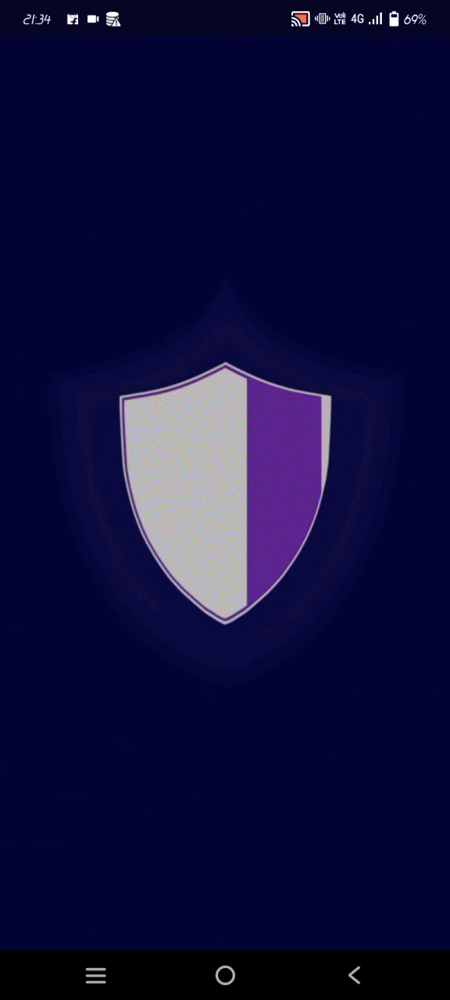

 
## Women Safety Application

## Demo Application

## Introduction

The Women Safety Application is a mobile app developed using Flutter that focuses on ensuring the safety of women by providing a set of essential features and functionalities.

## Features

- **Emergency SOS:** Allows users to send emergency alerts to predefined contacts with their current location.
- **Location Tracking:** Provides real-time location tracking and sharing options.
- **Quick Dial:** Allows users to quickly call emergency helplines and contacts.
- **Safety Tips:** Offers valuable safety tips and guidelines.

## Getting Started

